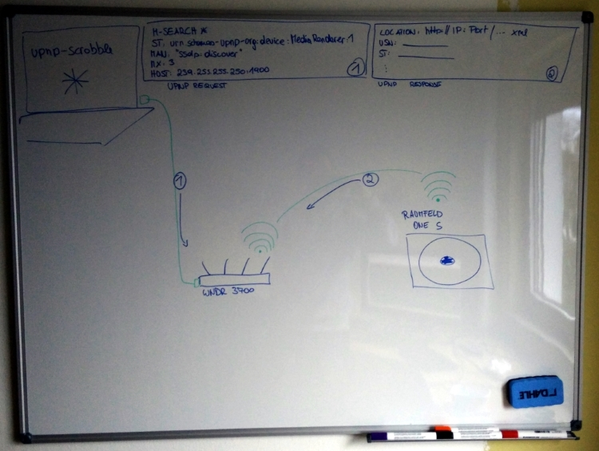
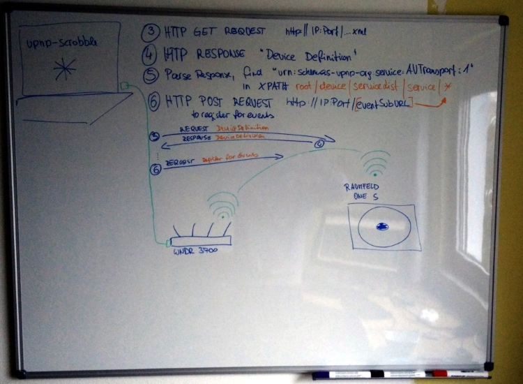
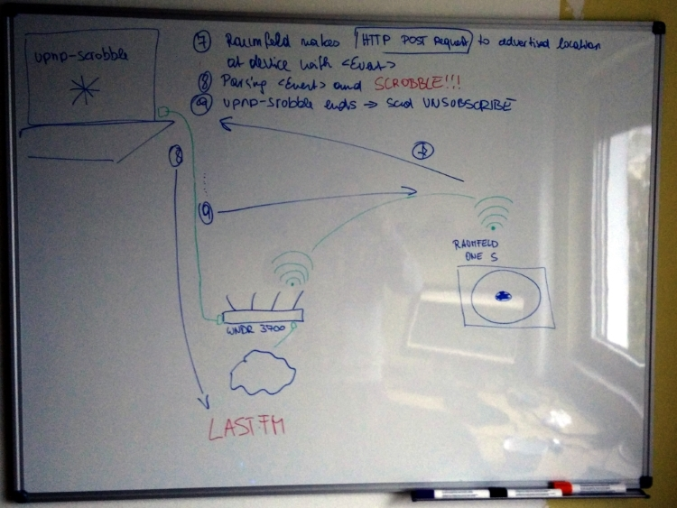

# node-upnp-scrobble-js

Scrobble plays of your UPnP-devices to [Last.fm](http://www.last.fm/)

## Install
    $ npm install

## Run
    $ node app.js

For pretty logging-output

    $ npm install bunyan -g
    $ node app.js | bunyan

## Flow

The UPnP discovery and subscription flow is completely handled by [peer-upnp](https://github.com/fraunhoferfokus/peer-upnp), and follows the following strategy:

1. Issuing an `M-Search` request, asking for `urn:schemas-upnp-org:device:MediaRenderer:1`
2. UPnP-device says *Hi*
3. Requesting the UPnP-device defintion from the device (`LOCATION` of response) over HTTP
4. UPnP-device returns its defintion
5. Parsing the definition, looking for a `urn:schemas-upnp-org:service:AVTransport:1` service
6. Sending a `SUBSCRIBE` request over HTTP to the `eventSubURL` of the `AVTransport` service
7. UPnP-device emits events to the advertised callback URL over HTTP
8. Parsing the events data and sending it over to Last.fm

## Known issues

- upnp-scrobble uses [scribble](https://github.com/TerrordactylDesigns/scribble), which does not scrobble the album of your track. I have a [patched fork](https://github.com/dittodhole/scribble) available.
- ~~On a regular basis the UPnP-device does not send events. I am still investigating this very issue.~~ ~~Please use the `subscriptionTimeoutInSeconds` configuration parameter, which sould be decreased if you see missing notifications. This will result in a shorter timeout of the subscriptions, and a more frequent resubscription.~~ peer-upnp discovers the *optimal* resubscription interval by looking up the timeout from the `SUBSCRIBE` response.
- I have tested the setup with [Raumfeld One S](www.teufelaudio.com/raumfeld-audio-streaming/raumfeld-one-s-p14713.html), [Netgear WNDR 3700](www.netgear.com/home/products/networking/wifi-routers/wndr3700.aspx), and a [Raspberry PI 2](https://www.raspberrypi.org/products/raspberry-pi-2-model-b/) running [Raspbian](https://www.raspbian.org/).

## License

node-upnp-scrobble-js is published under [WTFNMFPLv3](http://andreas.niedermair.name/introducing-wtfnmfplv3).