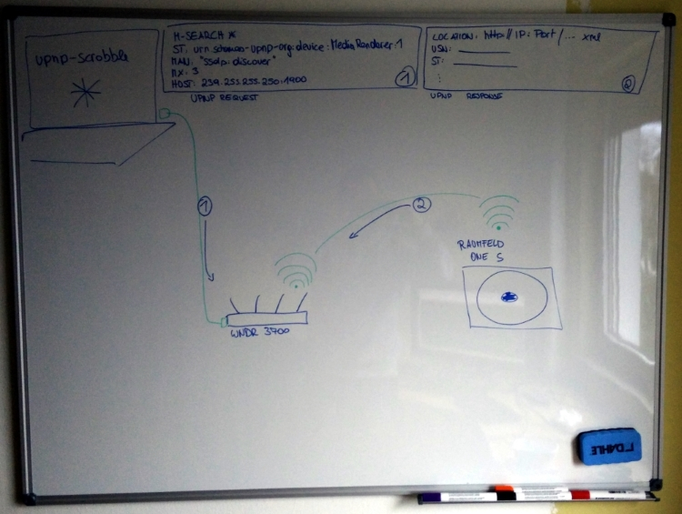
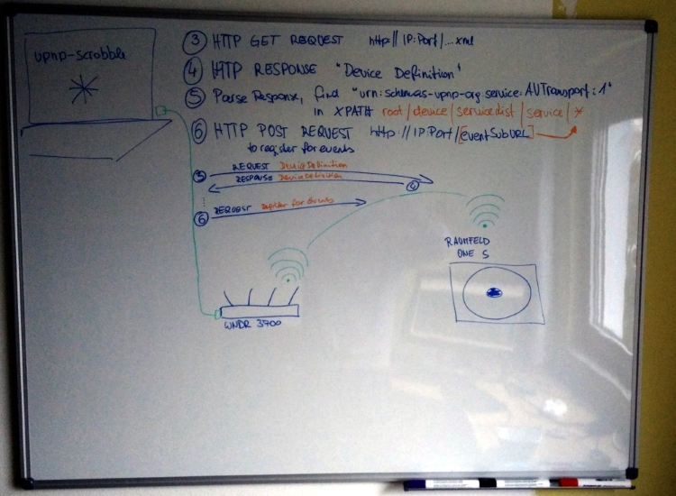
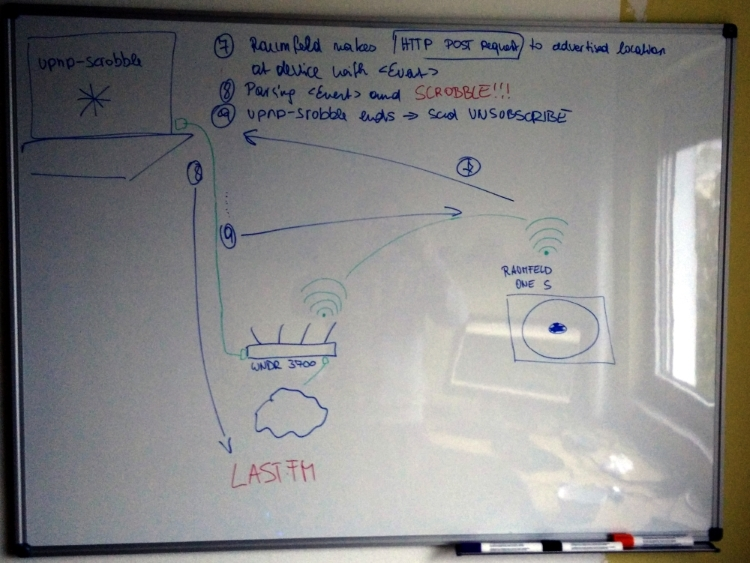

# upnp-scrobble

Scrobble plays of your UPnP-devices to Last.fm

## install
    $ npm install

## run
    $ node app.js

For pretty logging-output

    $ npm install bunyan -g
    $ node app.js | bunyan

## flow

1. upnp-scrobble issues an *M-Search* request, asking for *urn:schemas-upnp-org:device:MediaRenderer:1* (**CAUTION** sometimes devices with non-matching *ST* say *Hello*)
2. UPnP-device says *Hello*
3. upnp-scrobble requests the UPnp-device defintion from the device (*LOCATION* of *Hello* 
response)
4. UPnP-device returns its defintion
5. upnp-scrobble parses the definition, looking for a *urn:schemas-upnp-org:service:AVTransport:1* service
6. Sends a *SUBSCRIBE* to the *eventSubURL* of the *AVTransport* service
7. UPnP-device pushes upnp-scrobble on events
8. upnp-scrobble pushes the play to Last.fm
9. upnp-scrobble sends an *UNSUBSCRIBE* request upon exit

## known issues

- upnp-scrobble uses [scribble](https://github.com/TerrordactylDesigns/scribble), which does not scrobble the album of your track. I have a [patched fork](https://github.com/dittodhole/scribble) available.
- ~~~Sometimes~~~ On a regular basis the UPnP-device does not send events. I am still investigating this very issue.
- I have tested the setup with [Raumfeld One S](www.teufelaudio.com/raumfeld-audio-streaming/raumfeld-one-s-p14713.html), [Netgear WNDR 3700](www.netgear.com/home/products/networking/wifi-routers/wndr3700.aspx), and a [Raspberry PI 2](https://www.raspberrypi.org/products/raspberry-pi-2-model-b/) running [Raspbian](https://www.raspbian.org/).